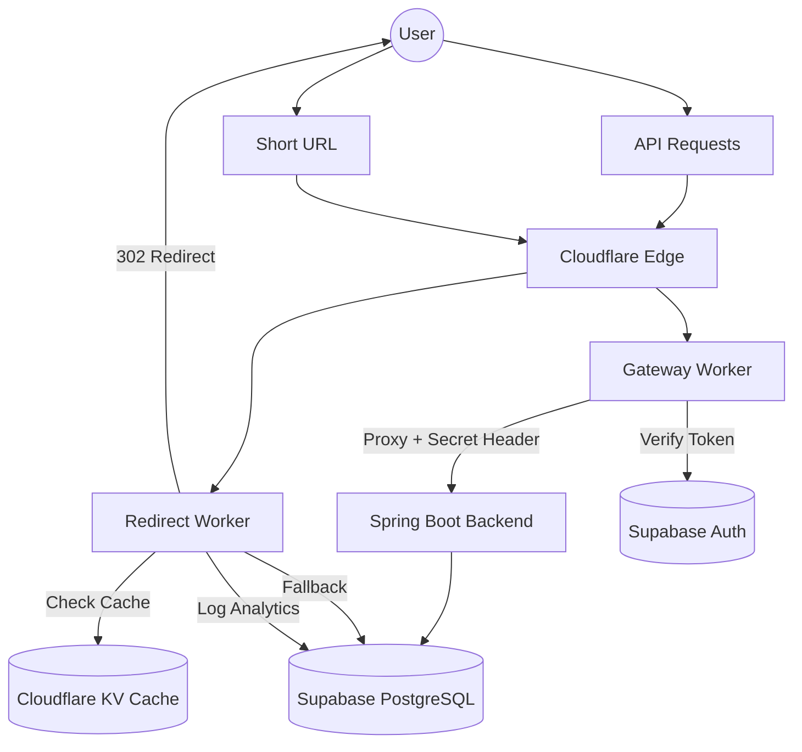

# System Design: Scalable URL Shortener

This document outlines the architecture and design decisions for the URL Shortener project.

## High-Level Architecture

The system is designed for high availability, low latency (via edge caching), and secure communication between components.

## Core Components

### 1. Frontend (Next.js)

- **Technology**: React/Next.js with Tailwind CSS.
- **Role**: Provides the dashboard for users to create, manage, and track their shortened URLs.
- **Auth**: Integrates with Supabase Auth for client-side session management.

### 2. API Gateway (Cloudflare Worker)

- **Role**:
  - Proxies requests to the Spring Boot backend on GCP.
  - Validates Supabase JWT tokens for protected routes (e.g., creating URLs).
  - Injects the `X-Cloudflare-Secret` to secure the backend origin.

### 3. Redirect Service (Cloudflare Worker)

- **Role**:
  - High-performance redirection logic at the edge.
  - **Caching**: Uses Cloudflare KV to store URL mappings (24h TTL) to minimize database hits.
  - **Analytics**: Asynchronously logs visitor data (IP, Country, User-Agent) to Supabase.

### 4. Backend Service (Spring Boot)

- **Technology**: Java 21, Spring Boot 3.
- **Hosting**: GCP Cloud Run (Serverless).
- **Role**:
  - Business logic for generating unique short codes.
  - Database management (CRUD operations for URLs).
  - **Security**: Implements a `CloudflareSecurityFilter` to block any request not originating from the Cloudflare Worker.

### 5. Database & Auth (Supabase)

- **PostgreSQL**: Stores URL mappings and analytics logs.
- **Real-time**: Enables immediate updates for the dashboard.
- **Auth**: Centralized identity management.

## Security Model: Origin Protection

To protect the GCP Cloud Run backend from direct public access, we use a **Shared Secret Header** strategy:

1.  A strong random string (`CLOUDFLARE_ORIGIN_SECRET`) is stored in both Cloudflare and GCP.
2.  The Cloudflare Worker adds `X-Cloudflare-Secret: <secret>` to every request.
3.  The Spring Boot Filter validates this header.
4.  **Benefit**: Only the trusted Cloudflare Gateway can talk to the backend, preventing attackers from bypassing authentication by hitting the backend IP directly.

## Scaling Strategy

- **Edge Caching**: Cloudflare KV ensures that frequent redirects bypass the database entirely, reducing latency and database load.
- **Serverless Backend**: GCP Cloud Run scales from 0 to N instances based on request volume.
- **Asynchronous Analytics**: The Redirect Worker logs analytics in the background (`ctx.waitUntil`), so the user redirect is never delayed by logging logic.
